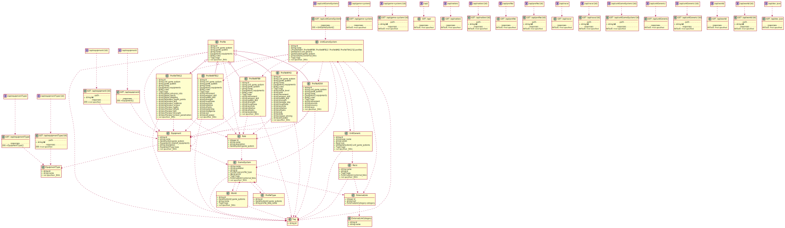

# warhammer-portal





## prerequisites

### create DB


```
create database warhammer_portal character set UTF8 collate utf8_bin;
GRANT ALL ON warhammer_portal.* TO 'warhammer_portal' IDENTIFIED BY 'warhammer_portal';
```


## init
```

bin/console doctrine:fixtures:load
```


## asset 

first time
```

 yarn encore dev
```

for dev

```
yarn encore dev --watch
```


for prod
 
```
yarn encore production
```

## code cleaning

Test with 

```
./vendor/bin/phpcs
```

Fix with 
```
./vendor/bin/php-cs-fixer fix
``` 

